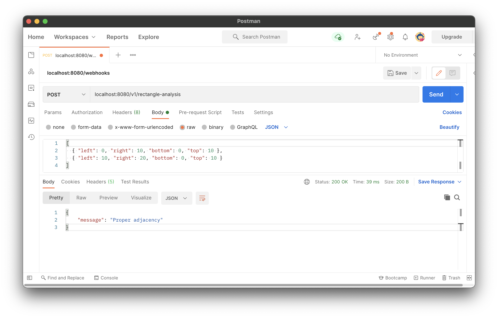

# Rectangle-analyzer

## Description

Rectangle-analyzer detects the relationship between 2 rectangles. The supported states are:

- Intersection
- Containment
- Proper adjacency
- Subline adjacency
- Partial adjacency
- No feature

Rectangle is defined with 4 properties: `left`, `right`, `bottom`, and `top`. They must be integers.

An rest API is exposed for easier access. 400(Bad request) will be returned if payload is invalid.


## Examples
```
Intersection:
[
    { "left": 0, "right": 10, "bottom": 0, "top": 10 },
    { "left": 5, "right": 15, "bottom": 0, "top": 10 }
]

Containment:
[
    { "left": 0, "right": 10, "bottom": 0, "top": 10 },
    { "left": 2, "right": 8, "bottom": 2, "top": 8 }
]

Proper adjacency:
[
    { "left": 0, "right": 10, "bottom": 0, "top": 10 },
    { "left": 10, "right": 20, "bottom": 0, "top": 10 }
]

Subline adjacency:
[
    { "left": 0, "right": 10, "bottom": 0, "top": 10 },
    { "left": 10, "right": 20, "bottom": 2, "top": 8 }
]

Partial adjacency:
[
    { "left": 0, "right": 10, "bottom": 0, "top": 10 },
    { "left": 10, "right": 20, "bottom": 0, "top": 15 }
]

No feature:
[
    { "left": 0, "right": 10, "bottom": 0, "top": 10 },
    { "left": 15, "right": 20, "bottom": 0, "top": 15 }
]
```

## Development
```
# Install dependencies
npm install

# Run the app
npm run app
```

## Tests
```
# Run linter
npm run lint

# Run unit test
npm run test

# Generate test coverage file
npm run coverage

# See the test coverage file
open coverage/lcov-report/index.html
```

## Future improvements
- Support multiple rectangles
- Support rectangles with rotation